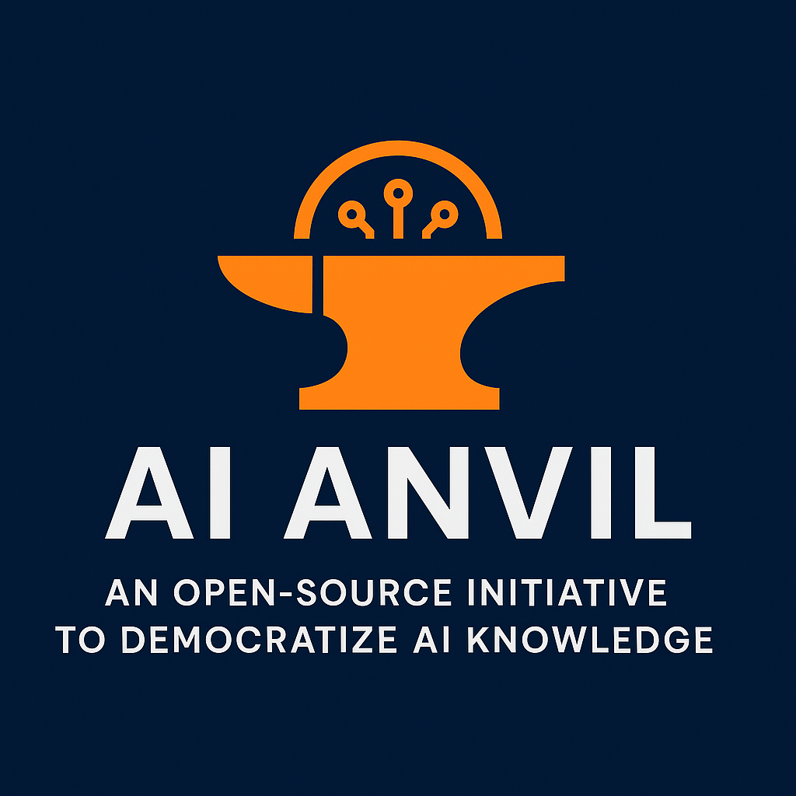

  

# 📜 Code of Conduct

## 👋 Welcome to AI Anvil

As contributors and maintainers of the **AI Anvil** project, we pledge to foster a welcoming and respectful environment for everyone, regardless of their background, identity, or experience level.

We believe in open collaboration and want AI Anvil to be a safe, inclusive, and inspiring space for learning and sharing AI knowledge.

---

## 💬 Our Standards

Examples of behavior that contribute to a positive environment:

- ✅ Using welcoming and inclusive language
- ✅ Being respectful of differing viewpoints and experiences
- ✅ Giving and receiving constructive feedback graciously
- ✅ Accepting responsibility and apologizing for mistakes
- ✅ Helping others learn and grow

Examples of unacceptable behavior:

- 🚫 Harassment or discrimination of any kind
- 🚫 Personal attacks or insults
- 🚫 Unwelcome sexual attention or advances
- 🚫 Trolling, inflammatory comments, or disruptive behavior
- 🚫 Publishing private information without consent

---

## 🚀 Our Responsibilities

Project maintainers are responsible for:

- Clarifying standards of acceptable behavior
- Reviewing reported violations and taking action
- Removing or rejecting inappropriate comments, commits, code, or contributions

---

## 🧭 Scope

This Code of Conduct applies:

- Within all project spaces (repo, issues, PRs, discussions)
- In public and private communications related to the project

---

## 🛠️ Reporting Issues

If you experience or witness unacceptable behavior, please report it by contacting:

📧 **Abhishek Jaiswal** – [abhishek.77647@gmail.com]  

All reports will be handled with discretion and confidentiality.

---

## 📜 Enforcement

Instances of abusive, harassing, or otherwise unacceptable behavior may be addressed by the maintainers. They may take actions including:

- Warning the offender
- Temporary or permanent ban from the project
- Reporting to relevant authorities if necessary

---

## 🧾 Attribution

This Code of Conduct is adapted from the [Contributor Covenant](https://www.contributor-covenant.org), version 2.1.

---

Together, let’s build a positive, inspiring AI learning space for all! 💡🌐
