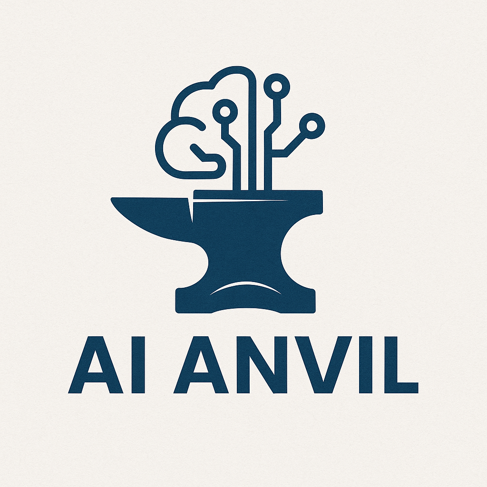

  

# 🛠️ AI Anvil

> **An open-source initiative to democratize AI knowledge — from fundamentals to future tech.**

---

## 🎯 Goal

**AI Anvil** is a public, open-source effort to **build and share high-quality knowledge in AI, Machine Learning, Deep Learning, Generative AI, and Agentic AI** — in a format that’s free, practical, and accessible to everyone.

The goal is simple but ambitious:  
🔹 Empower learners around the world to **build intelligent systems from scratch**.  
🔹 Bridge the gap between theory and real-world AI systems.  
🔹 Support the global AI community through **open education and collaboration**.

---

## 🌍 Impact

- 💡 Designed for **self-learners, students, and AI enthusiasts** with any background  
- 📖 Provides **insightful, beginner-friendly to advanced content** across key AI domains  
- 🔧 Focused on **real-world applications**, not just academic theory  
- 🚀 Built to **scale with the future** of AI — from traditional ML to multi-agent systems  

This project is for **every curious mind** that wants to shape the future using intelligent technologies.

---

## 📜 License

This project is licensed under the [Apache License 2.0](LICENSE).

---

## 🙌 Connect & Collaborate

Made with ❤️ by **Abhishek Jaiswal**  
🔗 [LinkedIn](https://www.linkedin.com/in/abhishekjaiswal076/) | 🐦 [Twitter](https://x.com/Abhishek_4896) | 🌐 [Kagggle](https://www.kaggle.com/abhishekjaiswal4896)  🖥️ [Dev Community](https://dev.to/abhishekjaiswal_4896)

> “Forge your future in AI — one neuron at a time.” 🔨🧠
